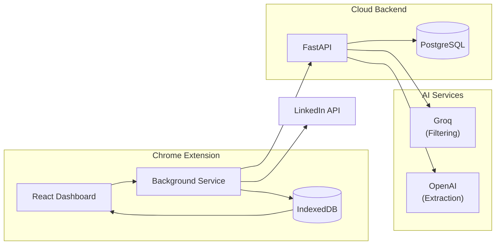

# LinkedIn Job Hunter

**AI-powered Chrome extension that discovers job opportunities hidden in LinkedIn posts**

<!-- Replace YOUR_CHROME_WEB_STORE_URL with your actual Chrome Web Store listing URL -->

---

## Demo

<!--
  To add your demo video:
  1. Upload your MP4 file to this repo (e.g., in an assets/ folder)
  2. Replace the video src below with your video path

  Option A: If uploading to GitHub releases or assets
  <video src="https://github.com/YOUR_USERNAME/YOUR_REPO/assets/VIDEO_ID/demo.mp4" width="100%" controls></video>

  Option B: If storing in repo
  <video src="assets/demo.mp4" width="100%" controls></video>
-->

<video src="assets/demo.mp4" width="100%" controls>
  Your browser does not support the video tag. <a href="assets/demo.mp4">Download the demo video</a>
</video>

---

## The Problem

Most job opportunities never make it to LinkedIn's job board. Hiring managers announce roles in posts, recruiters share openings in their feed, and companies post about growth before listing positions. Manually scrolling through your feed hoping to catch these opportunities is time-consuming and unreliable.

## The Solution

LinkedIn Job Hunter automates the discovery of job opportunities hidden in LinkedIn posts. It searches posts using your keywords, uses AI to filter out irrelevant content, and extracts structured job data—all while continuously monitoring for new opportunities in the background.

---

## Features

| Feature | Description |
|---------|-------------|
| **Smart Search** | Searches LinkedIn posts via GraphQL API—not just the job board |
| **AI Filtering** | Groq-powered relevance screening removes noise from results |
| **Job Extraction** | OpenAI extracts structured data: titles, companies, locations, salary info |
| **Auto-Refresh** | 15-minute monitoring cycles catch new opportunities as they're posted |
| **Dashboard** | Filter by keyword, saved status, applied status, and AI relevance |
| **Export** | Generate self-contained HTML reports for offline use |

---

## Architecture

---

## Tech Stack

### Frontend
- **Plasmo** — Modern Chrome extension framework
- **React 18** — Component-based UI with live database queries
- **TypeScript** — Full type safety
- **Tailwind + shadcn/ui** — Polished, accessible components
- **Dexie.js** — IndexedDB wrapper for local storage

### Backend
- **FastAPI** — High-performance Python API
- **PostgreSQL** — Rate limiting and subscription state
- **Google Cloud Run** — Serverless deployment
- **Docker** — Containerized backend

### AI Pipeline
- **Groq** — Fast, cost-effective post filtering
- **OpenAI GPT-4o-mini** — Structured job data extraction
- **Dual-model architecture** — Optimized for speed and accuracy

### Security
- **OAuth 2.0** — Google authentication
- **Server-side API proxy** — AI keys never exposed to client
- **Rate limiting** — PostgreSQL-backed request throttling

---

## Install

<!-- Replace YOUR_CHROME_WEB_STORE_URL with your actual Chrome Web Store listing URL -->

  

---

## How It Works

1. **Search** — Enter keywords like "React developer" or "remote engineering"
2. **Filter** — AI screens posts for job-related content
3. **Extract** — Relevant posts are parsed for job details
4. **Monitor** — Auto-refresh keeps checking for new opportunities
5. **Track** — Mark posts as saved or applied to manage your pipeline
6. **Export** — Generate offline HTML reports to share or archive

---

## License

This project is proprietary software. The source code is not included in this repository.

---

  Built with React, FastAPI, and AI

